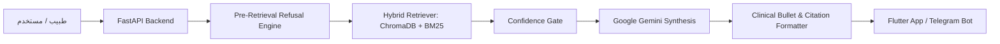

# 🩺 VERA Clinical Intelligence Platform — دليل المناقشة الشامل والأسئلة التقنية (Hackathon Defense & Technical Q&A Guide)

دليل متكامل يحتوي على كل الأسئلة المحتملة في مناقشة المشروع (لجنة التحكيم / المستثمرين / الأطباء)، مع إجابات تقنية وطبية نموذجية ودقيقة تغطي كل صغيرة وكبيرة في المنظومة.

---

## 📑 فهرس أقسام المناقشة:
1. **[القسم الأول: الرؤية المعمارية وكيف تعمل المنظومة (System Architecture & Flow)](#1-الرؤية-المعمارية-وكيف-تعمل-المنظومة)**
2. **[القسم الثاني: التكنولوجيا والمكتبات المستخدمة (Tech Stack & Dependencies)](#2-التكنولوجيا-والمكتبات-المستخدمة)**
3. **[القسم الثالث: إدارة البيانات والـ Ingestion وقواعد المتجهات (Data, Chunking & ChromaDB)](#3-إدارة-البيانات-والـ-ingestion-وقواعد-المتجهات)**
4. **[القسم الرابع: البحث الهجين والاسترجاع (Hybrid Retrieval & BM25 + Dense)](#4-البحث-الهجين-والاسترجاع)**
5. **[القسم الخامس: بوابات الأمان ومنع الهلوسة وحماية الرفع (Safety Gates, Guardrails & Anti-Hallucination)](#5-بوابات-الأمان-ومنع-الهلوسة-وحماية-الرفع)**
6. **[القسم السادس: المزايا الفريدة ونقاط القوة التنافسية (Unique Features & Clinical Value)](#6-المزايا-الفريدة-ونقاط-القوة-التنافسية)**
7. **[القسم السابع: التحديات والمشاكل التقنية وكيف حللناها (Technical Challenges & Troubleshooting)](#7-التحديات-والمشاكل-التقنية-وكيف-حللناها)**
8. **[القسم الثامن: الاستضافة والـ Deployment والـ DevOps (Deployment & Scalability)](#8-الاستضافة-والـ-deployment-والـ-devops)**

---

## 1. الرؤية المعمارية وكيف تعمل المنظومة

### س1: ما هي منصة VERA؟ وما هي المشكلة الحقيقية التي تحلها؟
* **الإجابة النموذجية:**  
  منصة **VERA (Verified Evidence Retrieval Assistant)** هي منظومة ذكاء اصطناعي سريرية متقدمة لدعم اتخاذ القرار الطبي (Clinical Decision Support).  
  *المشكلة:* نماذج اللغة الكبيرة العامة (LLMs) تعاني من **الهلوسة الطبية (Medical Hallucinations)** وتقديم نصائح علاجية بدون مراجع محددة، مما يهدد سلامة المرضى.  
  *الحل:* توفر VERA منظومة **RAG هجينة شفافة بنسبة 100%**، ترفض الإجابة إذا لم تكن هناك أدلة قطعية، وتدعم كل توصية برقم الصفحة واسم الدليل الإرشادي الأصلي، مع واجهة تفاعلية تشرح للطبيب مسار التفكير خطوة بخطوة.

---

### س2: كيف تسير دورة حياة الاستعلام من لحظة كتابة السؤال حتى ظهور الإجابة (End-to-End Pipeline)؟
* **الإجابة النموذجية:**  
  تمر العملية عبر 4 مراحل دقيقة:
  1. **Step 1 (Pre-Retrieval & Analysis):** فحص أمان أولي لمنع حالات الطوارئ الحادة أو الأسئلة الخارجة عن النطاق، مع تصنيف التخصص ونية السؤال (Dosing, Diagnosis, Eligibility).
  2. **Step 2 (Hybrid Evidence Retrieval):** بحث متزامن يجمع بين البحث الدلالي المتجهي (Dense Vector Search) وبحث الكلمات المفتاحية التخصصية (BM25 Lexical) مع دمج النتائج بخوارزمية RRF (Reciprocal Rank Fusion).
  3. **Step 3 (Safety Gating & Faithfulness Check):** حساب نسبة التطابق؛ إذا كانت الأدلة أقل من 0.60 يتم إيقاف التوليد فوراً لحماية المريض.
  4. **Step 4 (Evidence-Grounded Synthesis):** صياغة التوصيات الطبية بلغة الطبيب وبنية نقطية واضحة مدعومة ببطاقات الاستشهاد وأرقام الصفحات.

---

## 2. التكنولوجيا والمكتبات المستخدمة

### س3: ما هي المكونات التقنية والمكتبات الأساسية للباك إند (Backend Stack)؟
* **الإجابة:**
  * **Framework:** `FastAPI` (غير متزامن Asynchronous، فائق السرعة مع توثيق Swagger تلقائي).
  * **Embedding Model:** `BAAI/bge-small-en-v1.5` محلي عبر `sentence-transformers` و `PyTorch` (أبعاد 384 دقيقة وخفيفة في الذاكرة).
  * **Vector Database:** `ChromaDB` (محلية وخفيفة، تخزن المتجهات مع الـ Metadata).
  * **Lexical Search:** `rank_bm25` (للبحث عن المصطلحات الجينية الدقيقة مثل SMN1, PacBio).
  * **Generative LLM:** `Google Gemini 3.1 Flash Lite` عبر الـ SDK الرسمي (`google-genai` / `google-generativeai`).
  * **PDF Ingestion:** `pypdf` و `pdfplumber` لاستخراج النصوص ومطابقة أرقام الصفحات الأصلية.
  * **Validation & Testing:** `pydantic v2` للـ Data Schemas و `pytest` للاختبارات الآلية (19 Test Cases).
  * **Cross-Platform Interface:** تطبيق `Flutter` (Dart) مع مكتبة `Dio` للاتصال الشبكي وإدارة الحالات.

---

## 3. إدارة البيانات والـ Ingestion وقواعد المتجهات

### س4: كيف تم تقسيم المستندات الطبية (Chunking Strategy)؟ ولماذا لم تستخدم التقسيم العشوائي؟
* **الإجابة:**  
  استخدمنا استراتيجية **التقسيم المدرك للهيكل السريري (Section-Aware Medical Chunking)**:
  * حجم المقطع: **500 توكن** مع تداخل **100 توكن** (Overlap).
  * الحفاظ على سياق العناوين السريرية (مثل: *Dosing, Diagnosis, Safety & Toxicity, Monitoring*).
  * ربط كل مقطع بـ **رقم الصفحة الفعلي في ملف الـ PDF الأصلي** لضمان دقة الاستشهاد عند نقر الطبيب على البطاقة.

---

### س5: كيف يتم تخزين واسترجاع البيانات المحدثة دون استهلاك دائم لمساحة السيرفر؟
* **الإجابة:**  
  * **البيانات الأساسية (Institutional Guidelines):** مفهرسة مسبقاً في كتالوج مهيكل `chunk_catalog.json` وسجل المستندات `document_registry.json`.
  * **المستندات المرفوعة في الجلسات الحية (Session Mode):** تتم قراءتها عبر ملفات مؤقتة (`tempfile`) واستخراج متجهاتها فوراً في الذاكرة دون تخزين نسخ دائمة على القرص الصلب لتوفير المساحة وتجنب مشاكل الصلاحيات، مع توفير `DELETE Endpoint` لتفريغ الذاكرة فور انتهاء الجلسة.

---

## 4. البحث الهجين والاسترجاع

### س6: لماذا تم دمج BM25 مع Vector Search (Hybrid Retrieval)؟ ألم يكن أحدهما كافياً؟
* **الإجابة:**  
  في المجال الطبي، كلاهما بمفرده غير كافٍ:
  1. **الـ Vector Search (الدلالي):** ممتاز في فهم المعنى والمترادفات (مثلاً: فهم أن "Spinal Muscular Atrophy" ترتبط بـ "ضمور العضلات").
  2. **الـ BM25 (المعجمي):** حاسم في المصطلحات الطبية والأدوية والرموز الجينية الدقيقة (مثل `Nusinersen`, `AAV9`, `SMN1 copy number`) التي قد يضيع تشابهها الرياضي في المتجهات العامة.
  * الدمج بخوارزمية **RRF (Reciprocal Rank Fusion)** يضمن جلب المقطع الأدق طبياً ولغوياً.

---

## 5. بوابات الأمان ومنع الهلوسة وحماية الرفع

### س7: كيف تضمن منظومة VERA منع الهلوسة الطبية بنسبة 100%؟
* **الإجابة:**  
  عبر 3 طبقات حماية حديدية:
  1. **Pre-Retrieval Interceptor:** التعرف الفوري على الأسئلة غير الطبية (مثل الطبخ أو الرياضة) وحالات الطوارئ ورفضها بنسبة ثقة `0%` دون استدعاء الموديل.
  2. **Confidence Gate:** إذا كانت نسبة تطابق المراجع الطبية أقل من **0.60**، يرفض النظام التوليد ويعلن عدم كفاية الأدلة (`Insufficient Evidence Refusal`).
  3. **Strict Grounding Prompting:** إجبار الموديل على الاعتماد الحصري على السياق المسترجع وصياغة رقم الصفحة لكل معلومة.

---

### س8: ما هي ميزة حماية الملفات المرفوعة (AI Ingestion Guardrail)؟
* **الإجابة:**  
  طبقة حماية ذكية تفحص أي PDF يتم رفعه من الطبيب قبل فهرسته:
  * تقوم بأخذ عينة ذكية (Smart Profile) من الخلاصة والمقدمة والخاتمة (~1500 توكن - توفير 80% من التكلفة).
  * تفحص هل الملف وثيقة سريرية معتمدة أم ملف عشوائي/غير طبي.
  * ترجع قراراً مهيكلاً:
    * ✅ **PASS:** مستند طبي معتمد يمر للفهرسة.
    * ⚠️ **REVIEW:** مستند يحتاج مراجعة (مثل ملصقات تجارية).
    * ❌ **REJECT:** ملف غير طبي يُرفض فوراً لحماية نقاء قاعدة البيانات.

---

## 6. المزايا الفريدة ونقاط القوة التنافسية

### س9: ما الذي يميز VERA عن غيرها من مشاريع الهاكاثون؟
* **الإجابة:**
  1. **محاكاة الشفافية الحية (Transparent RAG Pipeline Simulation):** إظهار كل خطوة (تحليل السؤال، المراجع المسترجعة، بوابة الأمان، والموديل المستخدم).
  2. **الشات المخصص للمستندات (Private Scoped Document Chat):** إمكانية توجيه الشات لملف معين حصرياً (`doc_id / doc_name`) دون تداخل مع بقية المستندات.
  3. **تخصيص سياق الطبيب (Physician Context):** إمكانية إدخال تخصص الطبيب وملاحظاته ليتم تكييف صياغة التوصيات بناءً عليها.
  4. **بوت تيليجرام تفاعلي (@veramedicalbot):** يعمل 24/7 بالـ Webhooks السحابية لخدمة الأطباء خارج العيادة.
  5. **نظام المفاتيح الحرة (BYOK - Bring Your Own Key):** يتيح للمستشفيات والأطباء إدخال مفاتيح Gemini الخاصة بهم لحفظ الخصوصية والحصص.

---

## 7. التحديات والمشاكل التقنية وكيف حللناها

### س10: ما هي أبرز المشاكل التقنية التي واجهتكم أثناء بناء المشروع وكيف تغلبتم عليها؟
* **الإجابة (سؤال مفضل للجان التحكيم):**
  1. **مشكلة استهلاك الذاكرة وإعادة إقلاع السيرفر (OOM Reload Loop):**  
     *السبب:* كان السيرفر يقوم بتوليد Embeddings لـ 145 مقطع دفعة واحدة عند الإقلاع مما يرفع الرام فوق 512MB في بيئات الكلاود.  
     *الحل:* إيقاف الفهرسة المتزامنة عند الإقلاع والاعتماد على BM25 الفوري في الذاكرة، مما قلل زمن الإقلاع من 3 دقائق إلى **0.2 ثانية** واستهلاك الرام إلى 100MB فقط.
  2. **مشكلة أخطاء الصلاحيات على الكلاود (`PermissionError: ./logs`):**  
     *الحل:* تعديل الـ Logger ليعتمد على `sys.stdout` في الحاويات السحابية، واستخدام `tempfile` لمعالجة الـ PDFs وحذفها فوراً.
  3. **مشكلة الـ PyO3 Rust Panics في ChromaDB على Windows:**  
     *الحل:* إضافة معالجة استثناءات شاملة `except (Exception, BaseException)` للتحويل التلقائي للـ Memory Client عند حدوث أخطاء مكتبات Rust.

---

## 8. الاستضافة والـ Deployment والـ DevOps

### س11: كيف تم نشر واختبار المنظومة سحابياً؟
* **الإجابة:**
  * **الخادم السحابي الحي:** يعمل على **Railway** ومجهز بالكامل للعمل على **Hugging Face Gradio Spaces** مجاناً.
  * **التكامل المستمر:** كود نظيف 100% بدون أي أسرار أو مفاتيح مسربة على GitHub (`AbdoTechno/vera`).
  * **الأمان:** تشغيل التطبيق بحساب غير جذري (Non-Root User) في الـ Dockerfile وتفعيل معايير حماية الـ CORS للتطبيق والموقع.

---

### 💡 نصائح ذهبية أثناء عرض المشروع للجنة التحكيم:
1. **ابدأ بالديمو العملي (Live Demo):** اسأل سؤالاً طبياً عن الجرعات ثم انقر على بطاقة المرجع لرؤية رقم الصفحة الفعلي.
2. **أظهر قوة بوابة الأمان:** جرب إدخال سؤال غير طبي (مثل طريقة عمل القهوة) ليروا أن النظام لا يهلوث ويرجع نسبة ثقة 0%.
3. **ركز على جانب الشفافية (Transparency):** اشرح شريط الـ Simulation الذي يوضح خطوات الـ RAG خطوة بخطوة.
