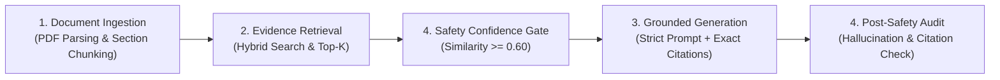

# 🩺 VERA — Verified Evidence Retrieval Assistant
### Evidence-Grounded Clinical Decision Support (CDS) System

[](https://python.org)
[]()
[]()
[]()

> **المبدأ الأساسي**: *الإجابة الفصيحة لا تعني بالضرورة إجابة آمنة (Fluent Answer ≠ Safe Answer)*  
> نظام ذكاء اصطناعي لدعم القرار السريري مستند حصرياً إلى الإرشادات الطبية المعتمدة ومزود بالاستشهادات الدقيقة `[اسم المستند | القسم | رقم الصفحة]`.

---

## ⚡ التشغيل السريع لخادم الـ API (FastAPI Quickstart)

لتشغيل السيرفر محلياً وربطه بتطبيق Flutter أو تجربة الـ Endpoints:

```powershell
# تشغيل السيرفر بأمر واحد
python run_server.py

# أو عبر uvicorn مباشرة
uvicorn src.api.main:app --host 0.0.0.0 --port 8000 --reload
```

- 📖 **التوثيق التفاعلي للـ API (Swagger Docs):** [http://localhost:8000/docs](http://localhost:8000/docs)
- 🩺 **فحص حالة السيرفر (Health Check):** [http://localhost:8000/api/v1/health](http://localhost:8000/api/v1/health)
- 📄 **عرض ملفات الـ PDF المرجعية:** [http://localhost:8000/pdfs](http://localhost:8000/pdfs)

---

## 📑 الفهرس (Table of Contents)
1. [التشغيل السريع لخادم الـ API (FastAPI Quickstart)](#-التشغيل-السريع-لخادم-ال-api-fastapi-quickstart)
2. [دليل نقاط الـ API والربط مع Flutter (API & Mobile Integration)](#-دليل-نقاط-ال-api-والربط-مع-flutter)
3. [خارطة طريق المذاكرة (Study Checklist)](file:///d:/AI%20Hackathon/New%20data/STUDY_GUIDE_CHECKLIST.md)
4. [الدليل التعليمي الشامل (System & Run Guide)](file:///d:/AI%20Hackathon/New%20data/HOW_TO_RUN_AND_SYSTEM_GUIDE.md)
5. [الهيكل العام للمشروع (Project Structure)](#-الهيكل-العام-للمشروع-project-structure)
6. [الطبقات المعمارية الأربع (The 4-Layer Architecture)](#-الطبقات-المعمارية-الأربع-the-4-layer-architecture)
7. [مفكرات التجارب اليومية (Day 1 - Day 5 Notebooks)](#-مفكرات-التجارب-اليومية-day-1---day-5-notebooks)
8. [كيفية التثبيت والتشغيل (Installation & Quickstart)](#-كيفية-التثبيت-والتشغيل-installation--quickstart)


---

## 🗂️ الهيكل العام للمشروع (Project Structure)

```text
d:/AI Hackathon/New data/
├── config/                          # إعدادات النظام ومعاملات النموذج
│   ├── config.yaml                  # الإعدادات المركزية (Chunk size, Top-K, thresholds)
│   └── README.md                    # دليل وحدة الإعدادات
│
├── data/                            # إدارة دورة حياة البيانات
│   ├── raw_pdfs/                    # ملفات الـ PDF الطبية الرسمية
│   ├── processed/                   # المقاطع النصية المهيكلة (chunk_catalog.json)
│   ├── knowledge_base/              # قاعدة المعرفة الشاملة (Markdown)
│   ├── vector_db/                   # قاعدة البيانات الشعاعية الدائمة (ChromaDB)
│   └── README.md                    # دليل إدارة البيانات
│
├── src/                             # الكود البرمجي للمنظومة
│   ├── ingestion/                   # الطبقة 1: قراءة الـ PDF والتقطيع الواعي بالأقسام
│   ├── embeddings/                  # بناء المتجهات والفهرسة الشعاعية
│   ├── retrieval/                   # الطبقة 2: البحث الدلالي والهجين وتوسيع الاستعلامات
│   ├── generation/                  # الطبقة 3: التوليد المنضبط بالأدلة وصياغة الاقتباسات
│   ├── safety/                      # الطبقة 4: بوابات الأمان، كشف الهلوسة، ومحرك الرفض
│   ├── evaluation/                  # مقاييس التقييم المعيارية (Precision@K, Faithfulness)
│   ├── utils/                       # دوال المساعدة، السجلات، وتنسيق المخرجات
│   └── README.md                    # دليل الكود البرمجي
│
├── notebooks/                       # مفكرات التجارب التفاعلية اليومية (Day 1 to 5)
│   ├── 01_ingestion_and_chunking.ipynb         # Day 1: استخراج النصوص والتقطيع
│   ├── 02_embeddings_and_indexing.ipynb        # Day 1-2: بناء الفهرس الشعاعي
│   ├── 03_retrieval_optimization.ipynb         # Day 2: تحسين الاسترجاع والبحث الهجين
│   ├── 04_grounded_generation_citations.ipynb  # Day 3: التوليد المنضبط والاقتباسات
│   ├── 05_safety_guardrails_evaluation.ipynb   # Day 4: حواجز الأمان والتقييم المعياري
│   ├── 06_end_to_end_demo_day5.ipynb           # Day 5: العرض النهائي التفاعلي للمحكمين
│   └── README.md                               # دليل المفكرات التفاعلية
│
├── eval_datasets/                   # مجموعات بيانات الاختبار والتقييم
│   ├── in_scope_test_queries.json              # استعلامات ضمن النطاق
│   ├── out_of_scope_test_queries.json          # استعلامات خارج النطاق (لاختبار الرفض)
│   ├── ambiguous_adversarial_queries.json      # حالات طوارئ وأسئلة مضللة
│   ├── gold_ground_truth_qa.json               # الأسئلة الذهبية مع إجابات واقتباسات مرجعية
│   └── README.md                               # دليل مجموعات التقييم
│
├── tests/                           # الاختبارات البرمجية المؤتمتة (Pytest)
│   ├── test_ingestion.py
│   ├── test_retrieval.py
│   ├── test_generation.py
│   ├── test_safety.py
│   └── README.md
│
├── docs/                            # التوثيق والمخططات المعمارية
│   ├── architecture_diagrams.md     # مخططات Mermaid للهيكل والتدفق
│   ├── judging_rubric_alignment.md  # جدول المطابقة مع معايير الـ 100 درجة
│   ├── clinical_guideline_summary.md # ملخص الأوراق الطبية المعتمدة
│   └── README.md
│
├── requirements.txt                 # الحزم والمكتبات المطلوبة
├── .env.example                     # نموذج المفاتيح والمتغيرات البيئية
└── VERA_PROJECT_README.md           # الدليل المرجعي الشامل للهاكاثون
```

---

## 🏛️ الطبقات المعمارية الأربع (The 4-Layer Architecture)



1. **Document Ingestion Layer**: قراءة الـ PDF، التقطيع الواعي بالعناوين والأقسام، وحفظ أرقام الصفحات بدقة.
2. **Retrieval Layer**: استرجاع هجين يجمع بين البحث الدلالي وبحث الكلمات المفتاحية الطبية (BM25) مع دمج الرتب (RRF).
3. **Generation Layer**: توليد سريري منضبط حصرياً بالأدلة مع ترقيم استشهادي `[Document | Section | Page]`.
4. **Safety Layer**: بوابة ثقة الاسترجاع، محرك رفض الاستعلامات الطارئة والخارجة عن النطاق، ومدقق الهلوسة.

---

## 🚀 مفكرات التجارب اليومية (Day 1 - Day 5 Notebooks)

تم إعداد 6 مفكرات تفاعلية جاهزة للتشغيل المباشر داخل مجلد `notebooks/`:

| المفكرة | اليوم | ما الذي ستقوم بتجربته؟ |
| :--- | :--- | :--- |
| [`01_ingestion_and_chunking.ipynb`](file:///d:/AI%20Hackathon/New%20data/notebooks/01_ingestion_and_chunking.ipynb) | Day 1 | تجربة قراءة ملفات الـ PDF واستخراج الجداول وتقطيع النصوص بناءً على الأقسام. |
| [`02_embeddings_and_indexing.ipynb`](file:///d:/AI%20Hackathon/New%20data/notebooks/02_embeddings_and_indexing.ipynb) | Day 1–2 | بناء المتجهات الشعاعية وفهرستها في ChromaDB وتجربة الاستعلامات البسيطة. |
| [`03_retrieval_optimization.ipynb`](file:///d:/AI%20Hackathon/New%20data/notebooks/03_retrieval_optimization.ipynb) | Day 2 | مقارنة البحث الدلالي والبحث الهجين (BM25 + Dense) وتوسيع المصطلحات الطبية. |
| [`04_grounded_generation_citations.ipynb`](file:///d:/AI%20Hackathon/New%20data/notebooks/04_grounded_generation_citations.ipynb) | Day 3 | توليد التوصيات السريرية واستخراج وتدقيق الاستشهادات `[Doc|Sec|Page]`. |
| [`05_safety_guardrails_evaluation.ipynb`](file:///d:/AI%20Hackathon/New%20data/notebooks/05_safety_guardrails_evaluation.ipynb) | Day 4 | اختبار الرفض الآمن، بوابات الثقة، وتشغيل تقييم `Precision@K` و `Faithfulness`. |
| [`06_end_to_end_demo_day5.ipynb`](file:///d:/AI%20Hackathon/New%20data/notebooks/06_end_to_end_demo_day5.ipynb) | Day 5 | المنصة التفاعلية المباشرة للعرض أمام لجنة التحكيم لجميع الحالات. |

---

## 🌐 دليل نقاط الـ API والربط مع Flutter

### 1. الاستعلام السريري ومحاكاة الـ RAG (`POST /api/v1/chat`)
- **Headers:** `X-Gemini-API-Key` أو `X-OpenAI-API-Key` (مفتاح الطبيب الخاص من التطبيق)
- **Request Body:**
```json
{
  "query": "ما هي معايير بدء علاج النوسينيرسين في مرضى ضمور العضلات الشوكي SMA؟",
  "language": "ar",
  "doctor_context": {
    "name": "د. سارة",
    "specialty": "طب أعصاب الأطفال",
    "notes": "التركيز على بروتوكولات التدخل المبكر"
  }
}
```
- **Response:** يرجع كائن JSON يحتوي على محاكاة الـ 4 مراحل للـ RAG (تصنيف الاستعلام ⬅️ استرجاع المقاطع والصفحات ⬅️ فحص الأمان وعدم الهلوسة ⬅️ التوليد الطبي مع الاستشهادات الدقيقة `citations`).

---

### 2. رفع مستند إرشادي جديد (`POST /api/v1/upload-document`)
- **Type:** `multipart/form-data`
- **Fields:** `file` (ملف PDF), `title` (اختياري), `category` (اختياري).
- تتم الفهرسة الشعاعية التلقائية في ChromaDB فور رفع الملف ليكون متاحاً للبحث فوراً.

---

### 3. استعراض التخصصات والأمراض (`GET /api/v1/domains`)
- يعرض التخصصات النشطة حالياً (SMA و Chromosomal Rearrangements) والتخصصات القادمة قريباً (الأورام، أمراض القلب، والتمثيل الغذائي).

---

### 4. استعراض ملفات الـ PDF المرجعية (`GET /api/v1/documents`)
- يعرض قائمة الأوراق العلمية المفهرسة مع روابطها المباشرة لتشغيلها في قارئ الـ PDF داخل التطبيق عبر `http://localhost:8000/pdfs/<filename>`.

---

## ⚡ كيفية التثبيت والتشغيل (Quickstart)

```bash
# 1. تثبيت المتطلبات
pip install -r requirements.txt

# 2. تشغيل سيرفر الـ API لربط تطبيق Flutter
python run_server.py
# أو:
uvicorn src.api.main:app --host 0.0.0.0 --port 8000 --reload

# 3. فتح التوثيق التفاعلي للـ API في المتصفح
# http://localhost:8000/docs

# 4. تشغيل الاختبارات الآلية للتأكد من سلامة النظام
pytest tests/ -v
```


# 4. فتح المفكرات التفاعلية
jupyter notebook
```

---

## 🏆 معايير التحكيم في الهاكاثون (Judging Rubric - 100 Pts)

- **Retrieval Quality (30 pts)**: مغطاة بالكامل عبر `src/retrieval/` والبحث الهجين والتقطيع الذكي.
- **Grounding & Citations (25 pts)**: مغطاة بالكامل عبر `src/generation/` وقوالب التوجيه المنضبطة.
- **System Architecture (15 pts)**: تصميم معماري تركيبي معياري عالي الاحترافية في `src/`.
- **Evaluation Rigor (15 pts)**: أجنحة اختبار معيارية ومقاييس `Precision@K` و `Faithfulness` في `src/evaluation/`.
- **Clinical Safety (10 pts)**: صمام أمان متكامل في `src/safety/` وبوابات الثقة والرفض.
- **UX & Live Demo (5 pts)**: مفكرة عرض تفاعلية `notebooks/06_end_to_end_demo_day5.ipynb` للمحكمين.
# vera
