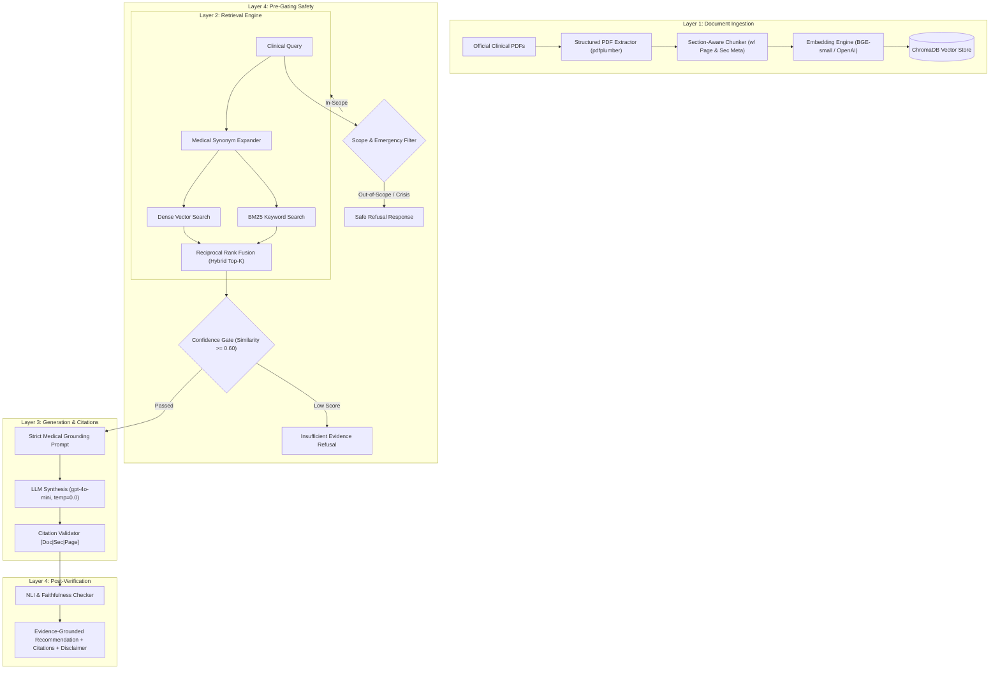
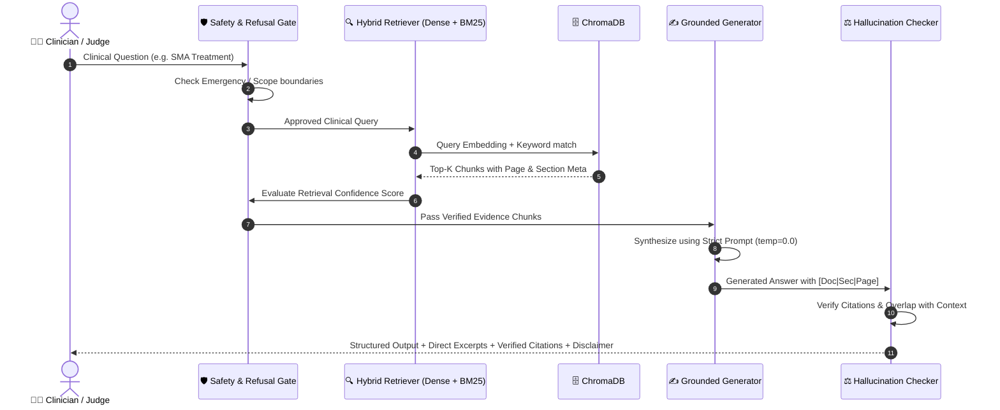

# 📐 VERA System Architecture & Diagrams

توثيق مرئي شامل للبنية المعمارية لمنظومة **VERA (Verified Evidence Retrieval Assistant)**.

---

## 1. البنية المعمارية ذات الـ 4 طبقات (4-Layer CDS Architecture)

---

## 2. مسار معالجة الاستعلام السريري (Query Flow)

